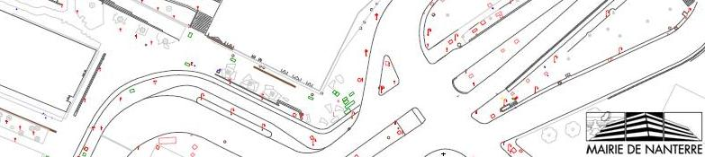
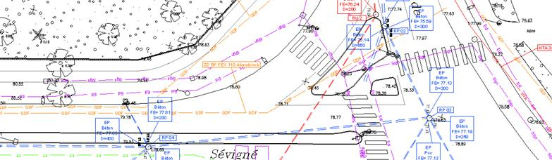
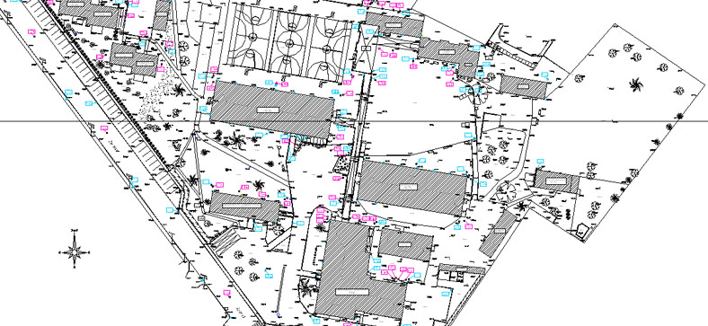
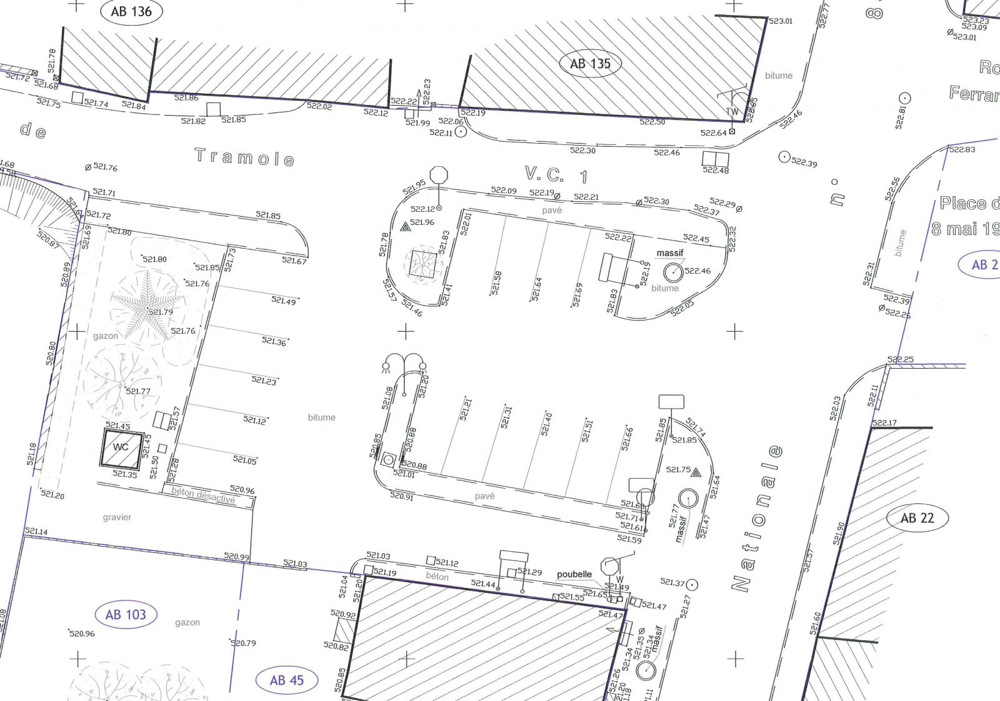

======================================
Des données topographiques hétérogènes
======================================

----

Quelques exemples de plans
==========================

Plan topographique 1
--------------------

..  :target: http://geogig.org/docs/start/intro.html
..  :height: 400px
..  :width: 200px

----

Plan topographique 2
--------------------

..  :target: http://geogig.org/docs/start/intro.html
..  :height: 400px
..  :width: 200px

----

Plan topographique 3
--------------------

..  :target: http://geogig.org/docs/start/intro.html
..  :height: 400px
..  :width: 200px

.. .. image:: ../_static/PlanTopographique2.pdf
..  :align: center
..  :target: http://geogig.org/docs/start/intro.html
..  :height: 400px
..  :width: 200px

----

.. .. image:: ../_static/PlanTopographique3.pdf
..   :align: center
..   :target: http://geogig.org/docs/start/intro.html
..  :height: 400px
..  :width: 200px

Plan topographique 4
--------------------

.. :scale: 50%
..  :target: http://geogig.org/docs/start/intro.html
..  :height: 400px
..  :width: 200px

.. .. image:: ../_static/Plan-Topographique-EPINAL.pdf
..   :align: center
..   :target: http://geogig.org/docs/start/intro.html
..  :height: 400px
..  :width: 200px

----

Pourquoi ces différences ?
==========================

Un plan topographique correspond à une prestation dont les caractéristiques
sont précisées dans un cahier des charges.

----

Cette diversité de cahiers des charges est due à :

  * Des besoins différents

    - plan pour positionner des réseaux
    - plan pour des études sommaires
    - plan précis et exhaustif

----

  * Des procédures d'acquisition différentes

    - levés traditionnels
    - lévés scan, nuage de point
    - prises de vue

  * Des formats et des structurations différentes

    - des outils SIG différents

----

En résumé
=========

Sur une même zone, avec une configuration terrain identique,
il est possible d'affirmer qu'un plan topographique conforme
à un cahier des charges **A**
sera different d'un second plan dressé selon les prescriptions
d'un cahier des charges **B**

Visuellement, les répresentations des objets ne seront pas identiques.

D'un point de vue informatique, la comparaison des deux fichiers montrera
que l'organisation des données sera aussi différente.

----
