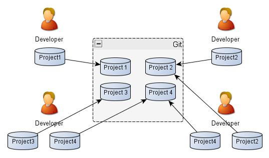
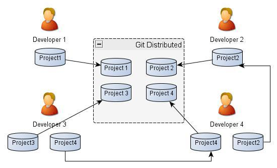
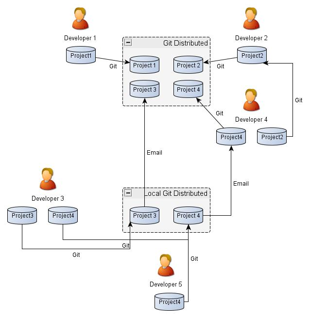

==============================
Présentation de l'outil geogig
==============================

Geogig : un logiciel de gesion de versions
==========================================

http://geogig.org/docs/start/tutorial.html

GeoGig est un système distribué de contrôle de version (DVCS) pour les données géospatiales.

**GeoGig** is an open source tool that draws inspiration from Git, but adapts its core concepts to handle distributed versioning of geospatial data.
http://geogig.org/

Les fonctionnalités de git
==========================

Suivi de l'évolution dans le temps
----------------------------------

Git permet d'enregistrer l'évolution d'une arborescence de fichiers.

.. image:: ../_static/git-ver.png
  :align: center
  :target: http://geogig.org/docs/start/intro.html

Branches
--------
Un dépot git peut gérer en parallèle plusieurs branches, et donc plusieurs historiques.

.. image:: ../_static/repositorydiagram.png
  :align: center

.. image:: ../_static/Usp56l.jpg
  :align: center

.. image:: ../_static/smb_karihikram_git_workflow.png
  :align: center

.. image:: ../_static/aSuccessfulGitBranchingModel.png
  :align: center
  :target: https://www.occitech.fr/blog/2014/12/un-modele-de-branches-git-efficace/
..  :height: 400px
..  :width: 200px

Depots distants
---------------
Chaque intervenant dispose d'une copie complète du dépot avec tout l'historique
et peut effetuer autant de changements locaux qu'il le souhaite.
Chacun est maitre de ce qu'il envoie sur le ou les dépots distants.

.. image:: ../_static/git_remotes.png
  :align: center
  :target: http://geogig.org/docs/start/intro.html
..  :height: 400px
..  :width: 200px

Plusieurs modes de fonctionnement

Repertoire de travail, Index, et Historique
-------------------------------------------

Contrairement à d'autres systèmes de gestion de versions,
lorsque vous executez git commit, git n'enregistre pas les modifications
depuis le repertoire de travail mais depuis l'index,
une zone tampon servant à préparer le prochain commit.

.. image:: ../_static/git-transport.png
  :align: center
  :target: http://geogig.org/docs/start/intro.html
..  :height: 400px
..  :width: 200px

.. image:: ../_static/geogig_workflow.png
  :align: center
  :target: http://geogig.org/docs/start/intro.html
..  :height: 400px
..  :width: 200px

.. image:: ../_static/geogig_workflow_remotes1.png
  :align: center
  :target: http://geogig.org/docs/start/intro.html
..  :height: 400px
..  :width: 200px

Ce document est une brève introduction aux principales idées de GeoGig.
Il explique comment configurer et utiliser GeoGit pour le gestion des versions des données spatiales,
en introduisant les opérations suivantes:

  - Importer des données spatiales non versionnés dans GeoGit
  - Apporter des changements et stocker des instantanés ("commit")
  - Maintenir de lignes indépendantes de modifications («de branche»)
  - Intégrer les changements de branches distinctes («fusionner»)
  - Résoudre les modifications contradictoires
  - Synchroniser des données à travers un réseau («push» et «pull»)
  - Marquer des versions spécifiques de données ("tag")
  - Exporter des données de GeoGit vers un shapefile

Ce tutoriel suppose aucune expérience préalable avec GeoGit.
Plus de détails peuvent être trouvés dans les sections suivantes.

Quelques notions de geogig : les acteurs, les branches, etc...
==============================================================

Les acteurs
-----------

Les niveaux d'acteurs
---------------------
extrait de la doc (https://github.com/boundlessgeo/GeoGit/wiki/requirements)

Acteur
Pour être en mesure d'identifier les principales exigences et les cas d'utilisation pour les fonctions de GeoGig et de l'environnement,
il est nécessaire d'identifier les principaux «acteurs» ou types d'utilisateurs qui interagissent avec GeoGig sur une base régulière.
Certains acteurs ont des rôles majeurs ou significatifs et devront interagir avec GeoGig sur une base fréquente.
Les autres utilisateurs ou acteurs vont interagir avec GeoGig sur une base moins fréquente et / ou auront des capacités limitées
avec les concepts opérationnels de GeoGig.
Il existe trois principaux acteurs étant abordés dans les récits utilisateur décrits dans cette section.
Ils sont : le propriétaire, le collaborateur et le contributeur.

Propriétaire

Lorsqu'un utilisateur crée son propre référentiel, cet utilisateur devient le «propriétaire» de ce référentiel.
En tant que tel, un propriétaire peut créer et gérer des référentiels, les rendre disponibles en ligne pour le partage,
et peut accorder l'accès à ce dépôt aux collaborateurs.
Si besoin, les propriétaires ont également le pouvoir de révoquer l'accès aux collaborateurs.

Collaborateur

A collaborator is a person with read and write access to a repository who has been invited to contribute by the repository owner.

Un collaborateur est un contributeur à un dépôt distant non détenu par lui-même,
qui a l'autorisation de modifier directement le dépôt distant par le biais d'une opération «push».
Les Opérations de "push" vers des dépôts distants sont utilisés pour appliquer de modifications à des branches
du référentiel local vers des branches des dépôts distants.
Les opérations de "push" sont également utilisés pour télécharger de nouvelles branches et les étiquettes,
et peuvent être utilisés pour supprimer des branches dans les dépôts distants.
Notez que ces dépôts partagent une histoire commune pour que ces opérations soient applicables.

Contributeur

A contributor is someone who has contributed to a project by having a pull request merged but does not have collaborator access.

Un contributeur est un propriétaire qui a accès en lecture seule à d'autres propriétaires de dépôts.
En tant que tel, il peut cloner, "sparse-cloner", ou récupérer les données à partir des dépôts distants non détenues par lui.
Un contributeur peut intégrer les autres modifications à son propre référentiel, c'est à dire,
les modifications effectuées par un collaborateur ou autre tiers autorisé à apporter des modifications aux données.
En aucune façon, un contributeur n'est autorisé à modifier un dépôt distant qu'il ne possède pas.
Un contributeur peut envoyer des correctifs au propriétaire du référentiel, et quand/si elle est appliquée,
on désigne le contributeur comme "auteur", tandis que la personne qui fait le commit devient le "committer"".

Les branches
------------
