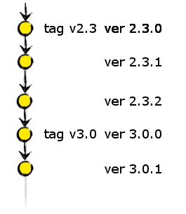
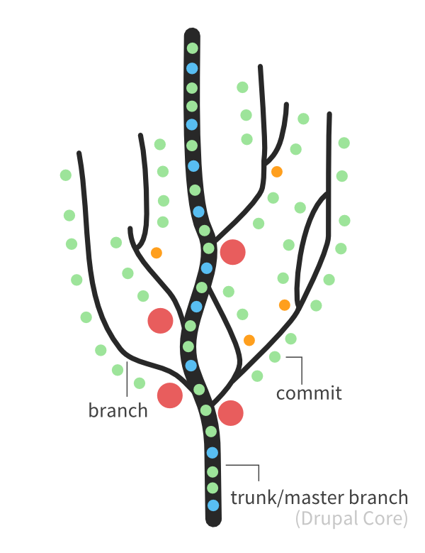
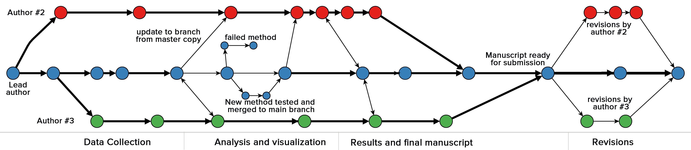
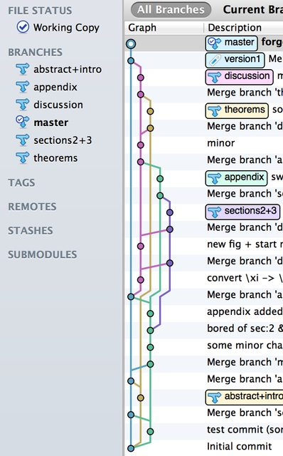
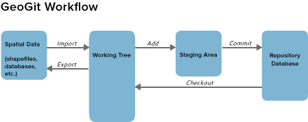

==============================
Présentation de l'outil geogig
==============================

Un logiciel de contrôle de versions
===================================

http://geogig.org/

GeoGig est un système distribué de contrôle de version (DVCS)
pour les données géospatiales.

**GeoGig** is an open source tool that draws inspiration from Git,
but adapts its core concepts to handle distributed versioning of geospatial data.

Les fonctionnalités de git
==========================

Suivi de l'évolution dans le temps
----------------------------------

Git permet d'enregistrer l'évolution d'une arborescence de fichiers.

Branches
--------

Un dépot git peut gérer en parallèle plusieurs branches, et donc
plusieurs historiques.

Git peut être utilisé pour la rédaction d'un document.

Ici, dans ce premier exemple, le choix a été de faire une branche par auteur.

*Ce choix n'est pas focement le plus judicieux : le travail en équipe
peut être facilité autrement grâce au concept de dépot distant.*

Dans ce second exemple, le choix est de faire une branche par partie de document.

Voici le modèle qui est utilisé par de nombreux développeurs

.. image:: ../_static/aSuccessfulGitBranchingModel.png
  :align: center
  :height: 550px
  :scale: 60%
  :target: https://www.occitech.fr/blog/2014/12/un-modele-de-branches-git-efficace/
..  :height: 400px
..  :width: 200px

Les dépots distants pour le travail en équipe
---------------------------------------------

Chaque intervenant dispose d'une copie complète du dépot avec tout l'historique
et peut effectuer autant de changements locaux qu'il le souhaite.

Chacun est maître de ce qu'il envoie sur le ou les dépots distants.

.. image:: ../_static/git_remotes.png
  :align: center
  :scale: 70%
..  :target: http://geogig.org/docs/start/intro.html
..  :height: 400px
..  :width: 200px

Plusieurs modes de fonctionnement sont possibles :

  * Un dépot central est utilisé par tous les collaborateurs

    .. image:: ../_static/gitversioncontrol.jpg
      :align: center
      :scale: 75%
      :target: https://yakiloo.com/getting-started-git/

  * En plus du dépot central, un collaborateur peut avoir un accès à un
    ou des dépots distribués.

    .. image:: ../_static/gitversioncontroldistributed.jpg
      :align: center
      :scale: 75%
      :target: https://yakiloo.com/getting-started-git/

  * Les dépots distribués peuvent ne pas être connectés en permanence.

    .. image:: ../_static/gitversioncontrolmultidistributed.jpg
      :align: center
      :scale: 75%
      :target: https://yakiloo.com/getting-started-git/

Repertoire de travail, Index, et Historique
-------------------------------------------

Contrairement à d'autres systèmes de gestion de versions,
lorsque vous executez *git commit*, git n'enregistre pas les modifications
depuis le repertoire de travail mais depuis l'index,
une zone tampon servant à préparer le prochain commit.

On distingue donc :

  - le répertoire de travail
  - l'index
  - le dépot local

Un dépot *git*, même non partagé, utilise ces trois notions.

Une quatrième notion est à ajouter, pour le partage des infos :

  - le dépot distant

.. image:: ../_static/git-transport.png
  :align: center
  :scale: 75%
..  :target: http://geogig.org/docs/start/intro.html
..  :height: 400px
..  :width: 200px

Pour une meilleure compréhension du fonctionnement de geogig,
un autre élément a été ajouté aux schémas :

En effet, les données géographiques doivent être *importées* ou *exportées* au
répertoire de travail de manière explicite.

..  :height: 400px
..  :width: 200px

Le schema complet pour geogig est donc :

.. image:: ../_static/geogig_workflow_remotes1.png
  :align: center
  :scale: 75%
  :target: http://geogig.org/docs/start/intro.html
..  :height: 400px
..  :width: 200px

Les types d'acteurs
===================

Selon la doc (https://github.com/boundlessgeo/GeoGit/wiki/requirements),
il faut distinguer les types d'acteurs qui interagissent avec GeoGig.

Certains acteurs ont des rôles majeurs ou significatifs et devront
interagir avec GeoGig sur une base fréquente.

Les autres utilisateurs ou acteurs vont interagir avec GeoGig sur une
base moins fréquente et / ou auront des capacités limitées
avec les concepts opérationnels de GeoGig.

Les principaux acteurs sont :

  - le propriétaire,
  - le collaborateur
  - et le contributeur.

Propriétaire
------------

Lorsqu'un utilisateur crée son propre référentiel, cet utilisateur
devient le «propriétaire» de ce référentiel.

En tant que tel, un propriétaire peut créer et gérer des référentiels,
les rendre disponibles en ligne pour le partage,
et peut accorder l'accès à ce dépôt aux collaborateurs.

Si besoin, les propriétaires ont également le pouvoir
de révoquer l'accès aux collaborateurs.

Collaborateur
-------------

*A collaborator is a person with read and write access to *
*a repository who has been invited to contribute by the repository owner.*

Un collaborateur est un contributeur à un dépôt distant
non détenu par lui-même, qui a l'autorisation de modifier directement
le dépôt distant par le biais d'une opération «push».

Les opérations de "push" vers des dépôts distants sont utilisés
pour appliquer des modifications à des branches
du référentiel local vers des branches des dépôts distants.

Les opérations de "push" sont également utilisés pour télécharger
de nouvelles branches et les étiquettes,
et peuvent être utilisés pour supprimer des branches dans les dépôts distants.

Notez que ces dépôts partagent une histoire commune
pour que ces opérations soient applicables.

Contributeur
------------

*A contributor is someone who has contributed to a project *
*by having a pull request merged but does not have collaborator access.*

Un contributeur est un propriétaire qui a accès en lecture seule
à d'autres propriétaires de dépôts.

En tant que tel, il peut cloner, "sparse-cloner",
ou récupérer les données à partir des dépôts distants non détenues par lui.

Un contributeur peut intégrer les autres modifications
à son propre référentiel, c'est à dire, les modifications effectuées
par un collaborateur ou autre tiers autorisé
à apporter des modifications aux données.

En aucune façon, un contributeur n'est autorisé à modifier
un dépôt distant qu'il ne possède pas.

Un contributeur peut envoyer des correctifs au propriétaire du référentiel,
et quand/si elle est appliquée, on désigne le contributeur comme "auteur",
tandis que la personne qui fait le commit devient le "committer".
