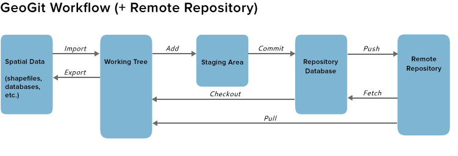

=====================
Les cas d'utilisation
=====================

http://geogig.org/docs/start/tutorial.html

Le tutorial de geogig,
explique comment configurer et utiliser GeoGig
pour le gestion des versions des données spatiales,
en introduisant les opérations suivantes:

  - Importer des données spatiales non versionnés dans GeoGit
  - Apporter des changements et stocker des instantanés ("commit")
  - Maintenir des lignes indépendantes de modifications («de branche»)
  - Intégrer les changements de branches distinctes («fusionner»)
  - Résoudre les modifications contradictoires
  - Synchroniser des données à travers un réseau («push» et «pull»)
  - Marquer des versions spécifiques de données ("tag")
  - Exporter des données de GeoGit vers un shapefile

Chacune de ces opérations est détaillée dans des documents techniques
sous la forme de **cas d'utilisation**

----

La mise en route
================

Configuration
-------------
(UC32 Configure Owner's Identity) https://github.com/boundlessgeo/GeoGit/wiki/uc32

Avant de commencer à travailler avec des données géospatiales,
vous devez indiquer à GeoGig quelle identité sera enregistrée dans
chaque commit.

.. code::

  geogit config --global user.name "Author"
  geogit config --global user.email "author@example.com"

----

(UC01 Create Repository) https://github.com/boundlessgeo/GeoGit/wiki/uc01

Tout d'abord, nous devons créer un nouveau dépot local.

Créez un répertoire de travail,
et initialiser GeoGig.

.. code::

  geogig init

Maintenant, votre repertoire GeoGig est prêt à gérer le versionning
de vos données géospatiales.

Notez que le répertoire .geogig a été créé.

----

Les principaux cas d'utilisation
================================

Rappel du schéma récapitulatif

..  :height: 400px
..  :width: 200px

----

Importer les données
--------------------

  - (UC06 Import FeatureType) https://github.com/boundlessgeo/GeoGit/wiki/uc06
  - (UC34 Check modification status) https://github.com/boundlessgeo/GeoGit/wiki/uc34

Ajouter des données
-------------------

  - ( ? )

Commiter les données
--------------------

  - (UC10 Commit Changes) https://github.com/boundlessgeo/GeoGit/wiki/uc10

Faire des Modifications
-----------------------

  - (UC34 Check modification status) https://github.com/boundlessgeo/GeoGit/wiki/uc34
  - ()
  - (UC10 Commit Changes) https://github.com/boundlessgeo/GeoGit/wiki/uc10

----

Consulter l'historique
----------------------

  - (UC25 List changesets) https://github.com/boundlessgeo/GeoGit/wiki/uc25

Créer une branche
-----------------

  - (UC16 Manage branches) https://github.com/boundlessgeo/GeoGit/wiki/uc16

Fusionner deux branches
-----------------------

  - (UC20 Switch branch) https://github.com/boundlessgeo/GeoGit/wiki/uc20
  - (UC17 Merge branch with no conflicts) https://github.com/boundlessgeo/GeoGit/wiki/uc17

Résoudre les problèmes de fusion
--------------------------------

  - (UC11 Review Changeset) https://github.com/boundlessgeo/GeoGit/wiki/uc11
  - (UC42 Resolve conflicts) https://github.com/boundlessgeo/GeoGit/wiki/uc42

----

Etiquetter une version
----------------------

  - (UC40 Create tag) https://github.com/boundlessgeo/GeoGit/wiki/uc40

Exporter à partir d'un répertoire geogit
----------------------------------------

  - (UC07 Export FeatureType) https://github.com/boundlessgeo/GeoGit/wiki/uc07

Synchroniser des répertoires
----------------------------

  - (UC02 Clone Repository) https://github.com/boundlessgeo/GeoGit/wiki/uc02
  - (UC03 Pull from remote) https://github.com/boundlessgeo/GeoGit/wiki/uc03
  - (UC04 Push to remote) https://github.com/boundlessgeo/GeoGit/wiki/uc04

----
