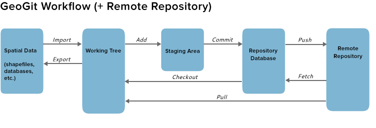

===================================
Premiers Tests : Des débuts simples
===================================

L'objectif est de vérifier si l'outil geogig peut être utilisé pour gérer
la constitution et la mise à jour du Plan de Corps de Rue Simplifié (PCRS).

Pour cela,
nous allons commencer par détailler une configuraton très simple,
un dépot central et deux dépots locaux,
avec des données topographiques conformes aux spécifications du PCRS.

Tout en laissant volontairement de coté certains aspects techniques,
nous continuerons les tests en interprétant un scénario de travail.

Une configuration simple
========================

L'acteur 'A', responsable du dépot central initie ce dépot PCRS commun.

.. code::

  geogig init

Les branches peuvent alors être définies

.. code::

  geogig branch PlanTopoControle
  geogig branch Controle
  geogig branch PlanTopoNonControle
  geogig branch PlanExecution
  geogig branch PlanProjet

Ce dépot, ne contient aucune donnée au départ.

L'acteur 'B' initialise son depot local "PCRS", en clonant le dépot central

.. code::

  geogig clone

Il est temps maintenant de manipuler des données géographiques.

Rappel du schéma récapitulatif

..  :height: 400px
..  :width: 200px

L'acteur 'B' importe dans son dépot local, dans la branche PlanTopoNonControle,
les plans topo qu'il souhaite partager.

.. code::

  geogig import
  geogig add
  geogig commit

Combien d'objets (combien de cases) sont présent dans le depot "PCRS"
de cet Acteur 'B', branche PlanTopoNonControle ?

.. code::

  geogig status
  geogig log
  geogig blame

L'acteur 'B' souhaite partager son travail : il publie son dépot local
vers le dépot distant, central.

.. code::

  geogig push

Dans la branche PlanTopoNonControle, le dépot central contient
dorénavant les plans topo de l'acteur 'B'.

L'acteur 'C' initialise son depot local "PCRS", en clonant le dépot central

.. code::

  geogig clone

En clonant le dépot central, l'acteur 'C' charge aussi les données,
c'est à dire les plans, de l'acteur 'B'.

L'acteur 'C' importe dans son dépot local, dans la branche PlanTopoNonControle,
ses propres plans topo qu'il souhaite ajouter.

.. code::

  geogig import
  geogig add
  geogig commit

Il publie son dépot local vers le dépot distant, central.

.. code::

  geogig push

Le dépot central contient les données des acteurs 'B' et 'C'.

Cependant, l'acteur 'B', qui était le premier contributeur, ne possède que ses
propres données dans son dépot local.

Quelles sont les différences entre le dépot local de l'acteur 'B'
et le dépot central (initié par l'acteur 'A') ?

.. code::

  geogig diff

Comment l'acteur 'B' peut récuperer les plans (cases)
qui sont disponibles dans le dépot central ?

.. code::

  geogig fetch
  geogig merge
  geogig pull

Des modifications sont apportés sur les données par un acteur :
Quelle est la procédure à suivre pour enregistrer ces modifications dans geogig ?

.. code::

  geogig pull
  geogig import
  geogig add
  geogig commit
  geogig push

Une configuration un peu plus avancée
=====================================

Les acteurs sont plus nombreux. Les modifications, les ajouts de données
doivent pouvoir se faire en parallèle, de manière indépendante.

Creation d'un dépot local geogig par acteur
-------------------------------------------

Il y aura donc un dépot geogig par acteur plus un dépot geogig central.

Dans son dépot local, chaque acteur sera libre d'ajouter et de modifier
ses données.

Mise à l'écart des éléments perturbateurs
=========================================

Pour simplifier les premiers tests, nous avons choisi de ne pas surcharger
ce travail de gestion du PCRS avec d'autres problèmes
que nous laissons volontairement de coté pour le moment.

On suppose que tous les acteurs travaillent avec le même format de fichier,
Postgis, et que tout le monde a adopté le système de "case"
comme unité d'emprise pour ses plans topographiques.

Un scénario simple pour une première simulation
===============================================

Prenons l'hypothèse initiale d'un territoire dépourvu
de plan (dépot central initial),
avec des acteurs qui ont la possiblité d'ajouter leurs plans afin de constituer
un référentiel commun.

Dans notre simulation, le territoire est constitué de 25 cases
(5 cases en X, 5 cases en Y)

L'objectif final de la simulation est de créer et
**de mettre à jour** un référentiel topo
sur ce territoire de 25 cases, en faisant participer les différents acteurs.

Les plans apportés par les premiers contributeurs pourront être
complètés et/ou controlés par d'autres partenaires.

En effet, les acteurs qui contribuent en apportant leurs plans n'ont pas
tous les mêmes exigences en ce qui concerne l'exhaustivité des objets levées.

Par exemple, pour l'acteur 'B', un plan topo est composé de murs,
de facades, de bordures de voirie.

Les haies et les arbres ne sont pas forcement présents dans ses plans.

En ce qui concerne l'acteur 'C', il veille à lever de manière systématique
les affleurants du réseau d'eau potable en plus des facades,
des murs et des bordures de voirie.

Par contre, les regards, chambres, coffrets et autres objets concernant
les reseaux secs ne font pas l'objet d'une si forte attention.

L'acteur 'D' est au contraire plutot spécialisé dans l'éclairage :
l'attention est donc porté sur les affleurants relatifs à ce réseau,
sans oublier les facades, murs, bordures de voirie et les arbres.

etc...

Un référentiel créé pas à pas
=============================

Nous envisageons de constituer ou de modifier le référentiel étape par étape.

Pour notre simulation, nous envisageons 5 étapes par acteur, chacun des acteurs
avançant à son rythme.

1. Etape 1
----------
Les acteurs 'B', 'C', 'D', 'E' ... contribuent au référentiel en ajoutant chacun
une case qu'il aura levée.

Il n'y a pas de chevauchement de cases.

2. Etape 2
----------
Les acteurs continuent à effectuer des levés topo et mettent à disposition
de nouveaux plans. Le référentiel grossit, la zone levée s'agrandit.

Il n'y a toujours pas de superposition de cases.

3. Etape 3
----------
Chaque acteur complète (enrichit) son levé avec des nouveaux objets

Nous abordons ici le problème de la mise à jour des données.

Un acteur a envie de contribuer en ajoutant une case qui a déjà été fournie
par un autre acteur :

Cet ajout est argumenté par le fait que les données qu'il apporte sont plus
complètes que les données initiales.

Geogig peut être utilisé via la commande

 .. code::

   git merge

Certains conflits devront être résolus manuellement

4. Etapes suivantes
-------------------

Ajout après ajout, les données de chacun enrichissent le dépot central.

Creation de données exemples
============================
Les données qui ont été utilisées dans ce test ont été créées avec libreoffice...

Le premier fichier sample.ods permet de montrer
l'évolution des emprises geographiques de 4 utilisateurs.

Le deuxième fichier, sample2.ods, permet de fabriquer le fichier sql
qui correspond aux 25 cases de l'emprise totale

A partir de ce deuxième fichier sample2.ods, nous allons fabriquer
3 fichiers sql :

  - create_sample.sql
  - insert_sample.sql
  - update_sample.sql

En executant ces trois fichiers, on obtient notre base exemple.
L'installation de Postgresql est détaillée dans le fichier

.. code::

  ~/Documents/install/source/environnementTravail/installPostgresql.sh

.. code::

  psql -h localhost -d gis -U fred -f create_sample.sql
  psql -h localhost -d gis -U fred -f insert_sample.sql
  psql -h localhost -d gis -U fred -f update_sample.sql

Utilisation du script

.. code::
  
  ./Documents/install/source/geogig/installGeogigSample.sh
