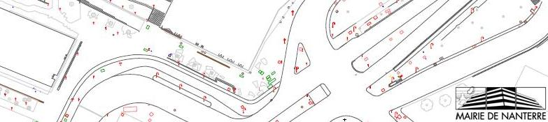
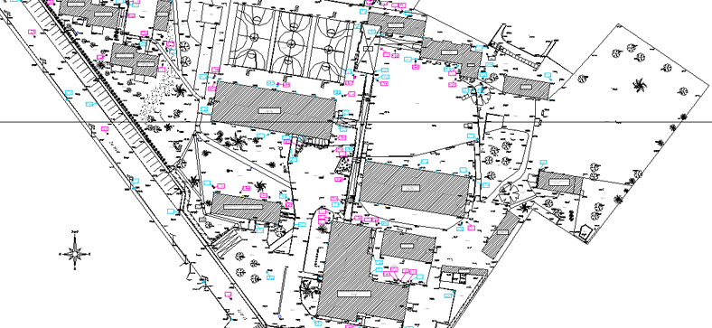
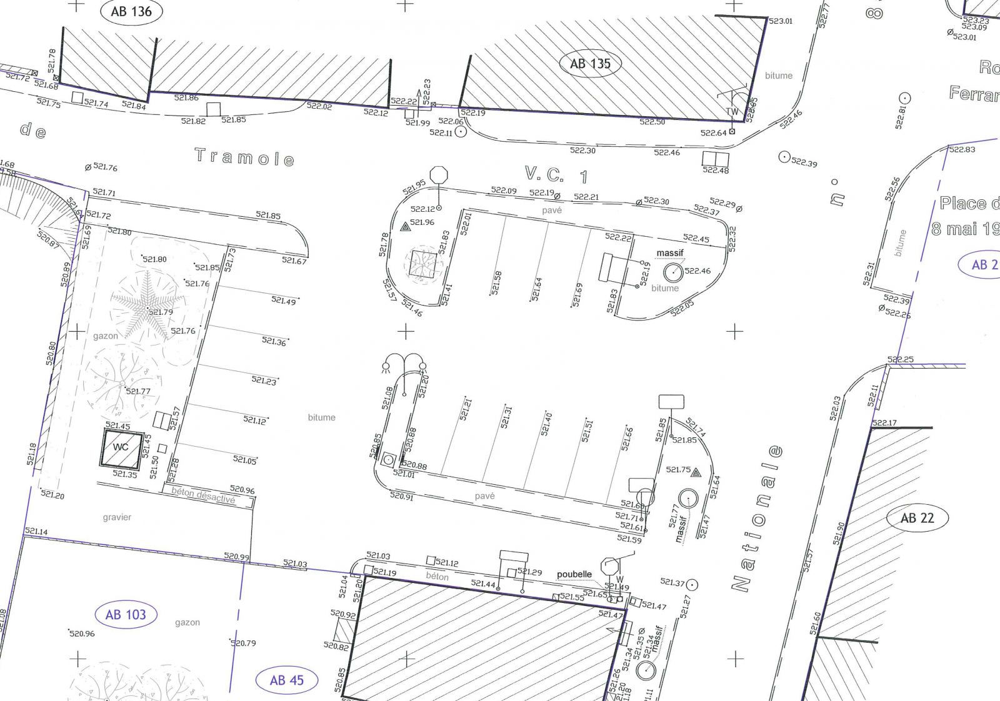

==========================
Les slides de présentation
==========================

Ce document est disponible au format html, pdf, mais aussi sous la forme de slides.

On peut les trouver aux adresses suivantes :

.. code::

  file:///home/fred/Documents/technic/build/slideshie/index.html
  file:///home/fred/Documents/technic/build/slideshov/geogig_hov.html

Sommaire des présentations
==========================

.. include:: ./chapter_sommaire_sanstitre.rst

.. image:: ../_static/aSuccessfulGitBranchingModel.png
  :align: center
  :target: http://geogig.org/docs/start/intro.html
..  :height: 400px
..  :width: 200px

.. image:: ../_static/geogig_workflow.png
  :align: center
  :target: http://geogig.org/docs/start/intro.html
..  :height: 400px
..  :width: 200px

.. image:: ../_static/geogig_workflow_remotes1.png
  :align: center
  :target: http://geogig.org/docs/start/intro.html
..  :height: 400px
..  :width: 200px

.. image:: ../_static/git_remotes.png
  :align: center
  :target: http://geogig.org/docs/start/intro.html
..  :height: 400px
..  :width: 200px

.. image:: ../_static/git-transport.png
  :align: center
  :target: http://geogig.org/docs/start/intro.html
..  :height: 400px
..  :width: 200px

..  :height: 400px
..  :width: 200px

.. image:: ../_static/rtge.jpg
  :align: center
  :target: http://geogig.org/docs/start/intro.html
..  :height: 400px
..  :width: 200px

..  :height: 400px
..  :width: 200px

.. image:: ../_static/PlanTopographique2.pdf
  :align: center
  :target: http://geogig.org/docs/start/intro.html
..  :height: 400px
..  :width: 200px

.. image:: ../_static/PlanTopographique3.pdf
  :align: center
  :target: http://geogig.org/docs/start/intro.html
..  :height: 400px
..  :width: 200px

..  :height: 400px
..  :width: 200px

.. image:: ../_static/Plan-Topographique-EPINAL.pdf
  :align: center
  :target: http://geogig.org/docs/start/intro.html
..  :height: 400px
..  :width: 200px
