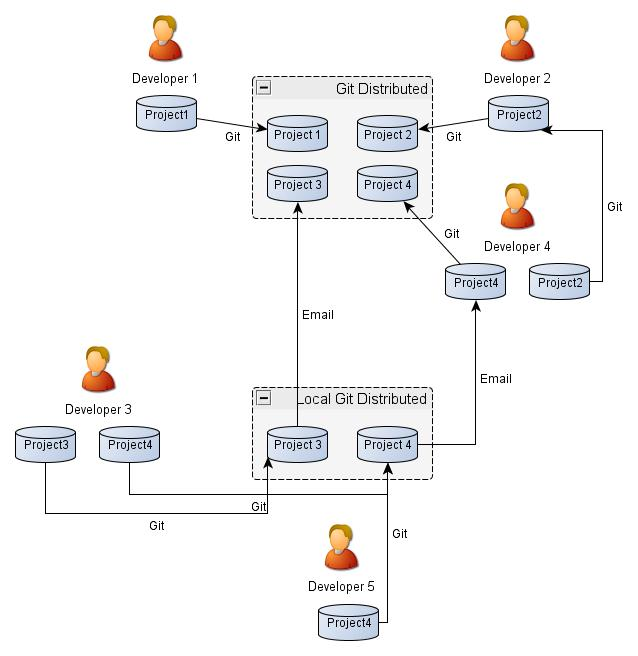

====================================================
Organisation pour la gestion du PCRS, mode distribué
====================================================

----

Jusqu'à présent, nous avons présenté l'utilisation de geogig avec un
modèle d'organisation limité à un seul niveau, le niveau départemental.

Le dépot central est utilisé par tous les collaborateurs

  .. image:: ../_static/gitversioncontrol.jpg
    :align: center
    :scale: 75%
    :target: https://yakiloo.com/getting-started-git/

----

Or nous avons aussi vu que geogig pouvait être utilisé en mode distribué :

Pour illustrer cette forme d'utilisation, nous allons introduire de
nouveaux acteurs (de niveau 2)

----

Présentation des nouveaux acteurs
=================================

Les acteurs "locaux" (niveau 2) sont les personnes travaillant
sur le PCRS à un niveau qui,
vu de l'extérieur,
peuvent être regroupées en 1 seul acteur de niveau 1.

----

Les acteurs locaux (niveau 2)
-----------------------------

Au sein de la Ville de La Rochelle, il est possible aussi de
définir une liste d'acteurs de niveau 2.

C'est le service Cartographie qui assure la gestion du PCRS
au niveau de la Ville vis à vis des partenaires extérieurs.

- VLR AC    = Aménagement et Construction = Service interne de la Ville de La Rochelle
- VLR Carto = Cartographie                = Service interne de la Ville de La Rochelle
- VLR DSI   = DSI                         = Service interne de la Ville de La Rochelle
- VLR EAU   = Eau                         = Service interne de la Ville de La Rochelle
- VLR ECL   = Eclairage                   = Service interne de la Ville de La Rochelle
- VLR Geom  = Géomètres                   = Groupement des géomètres titulaire du Marché de prestations topographiques Ville de La Rochelle
- VLR P     = Pluviales                   = Service interne de la Ville de La Rochelle
- VLR TP1   = Entreprise TP 1             = Entreprise de TP réalisant une prestation pour la Ville de La Rochelle
- VLR TP2   = Entreprise TP 2             = Entreprise de TP réalisant une prestation pour la Ville de La Rochelle
- VLR U     = Urbanisme                   = Service interne de le Ville de La Rochelle
- VLR V     = Voirie                      = Service interne de la Ville de La Rochelle

----

Deux dépots sont gérés par le service carto : le premier est à usage départemantale, le second est à usage interne.

https://github.com/dep17vlr/PCRS_public

https://git.ville-larochelle.fr/Carto/PCRS_private

Le geometre exterieur à la ville de geometre a aussi son ou ses dépots :

https://github.com/dep17VlrGeom/PCRS_public

https://git.geometre.fr/SocieteA/PCRS_private

Des services de la Ville ont laissé la gestion de leur dépot au service cartographie

----

Gestion au niveau local (niveau 2)
----------------------------------

Point de vue du service Cartographie

- Le propriétaire du dépot est "VLR Carto" (le service cartographie)
- Les collaborateurs sont "VLR AC" et "VLR Eau"
- les autres sont des contributeurs

Point de vue du service Aménagement et Construction

- Le propriétaire est "VLR AC" (le service Aménagement et Construction)
- Les collaborateurs sont "VLR Carto" et "VLR Eau"
- les autres sont des contributeurs

----

Cas d'utilisation
=================

Au niveau local
---------------

Le service Aménagement et Construction est missionné pour conduire un
projet sur une zone couvrant
un carrefour et deux voies perpendiculaires

Le service carto ne dispose d'aucun plan topographique.

ErDF dispose d'un plan avec une voie et une partie du carrefour
La CDA dispose d'un plan avec une partie de l'autre voie et du carrefour en entier

----
